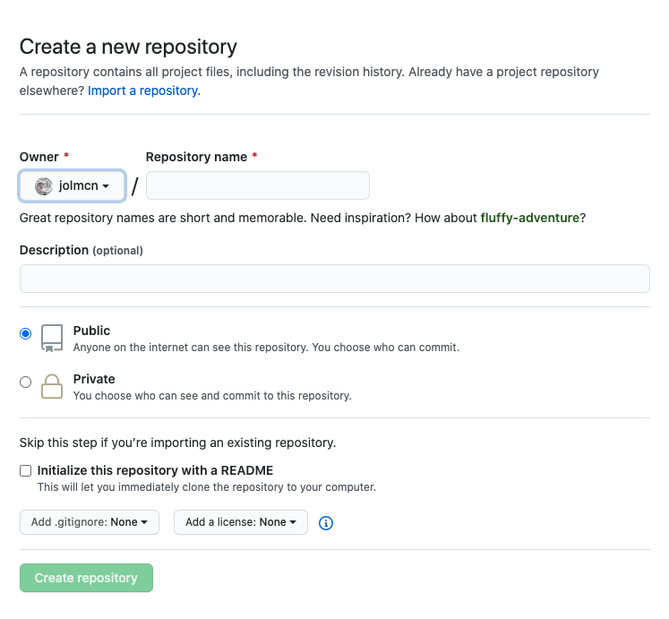
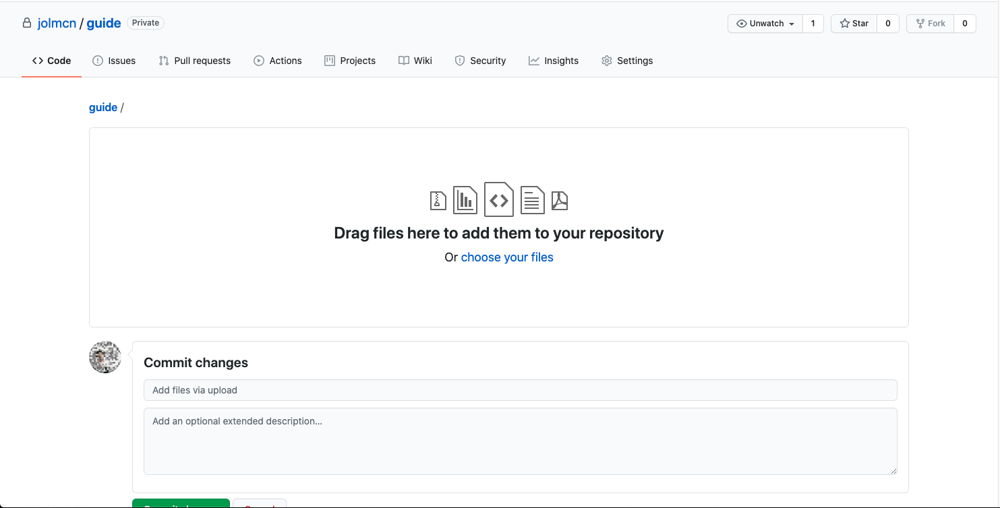
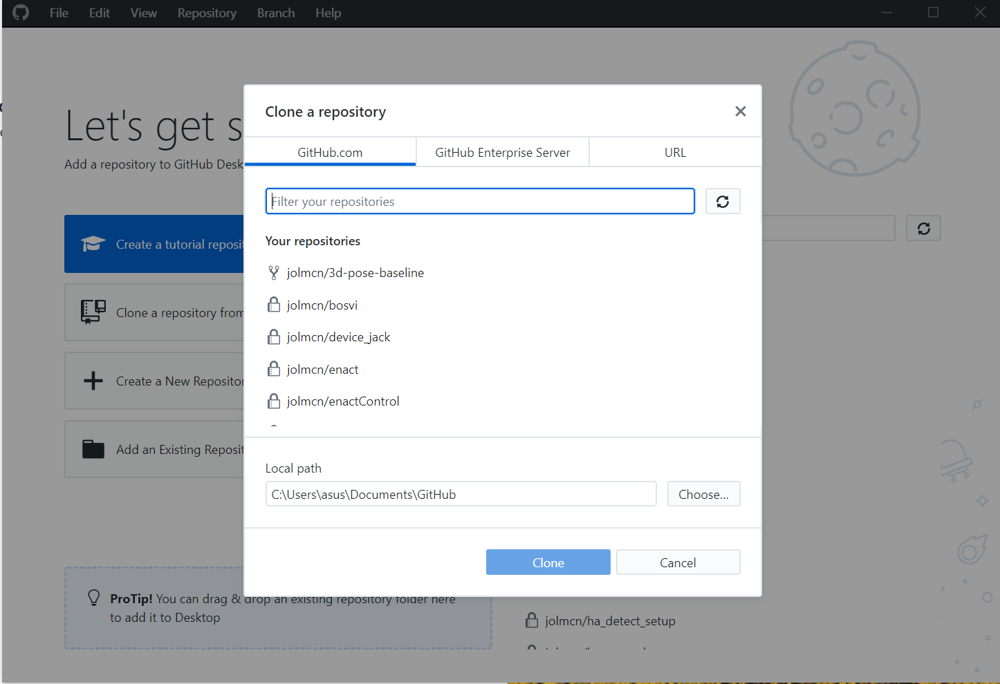

# Git, Python & Conda Guide

## Git

### Overview
Git is a version control system. It allows you to store code online and to move back and forward between older an newer versions of your code. 


Version control with Git goes something like this:
- A **Git Repository** is the name for a single project. **Repo** is the short name. 
- You can create a new **Git Repo** locally on your computer or using your Github/Gitlab account.
- You can download a **Repo** as a zipped folder directly, or you can *clone* it to your computer using either the terminal/command line or a GUI application. 
- Changes made to the downloaded (local) version of the **Repo** will not affect the version stored online until you *commit* and *push* your changes.
- Changes can be pushed to the **Master** branch of your **Repo** or to a new branch.
- You can switch easily between your **Master** branch and other created branches.
- Any changes you push can usually be reversed by *rolling back* to a previous *commit*.
- When working with a **repo** created by another Git user, you can create a  *fork* of the **repo**, essentially a copy of the **repo** on your own Git account that you can edit.
- When multiple people are working on a single **repo**, changes created on new branches can be **merged** into the *master* branch.
- This might not all be clear now, you will likely not need to use all of these functions! See **Use** section below for instructions on how to *clone* a **repository**, and how to *add*, *commit* and *push* changes.


### Installation

#### Prerequisites

Create an account on [GitHub](http://github.com/)

#### PC

##### Command Line Version
1. [Download](https://git-scm.com/download/win) and install.
	* This is what I tend to use. It comes with a dedicated command line application called Git Bash to run Git commands (e.g. *commit*, *add*, *clone*, etc).
	* **NOTE:** Even if you plan to use the GUI version below, I recommend downloading these tools. I have found that the GIT Bash terminal useful for Python and Conda (see below).
2. After installation, open the GIT Bash terminal, copy and paste the below code and hit enter (**replace 'username' and 'email' with the username and email you used when signing up to GitHub**)
	```
	git config --global user.name "username"
	git config --global user.email "email@example.com"
	```

##### GUI Version
1. [Download](https://desktop.github.com/) and install.
	* This is a desktop app created by GitHub. It will allow you to do all the same things you can do in the command line version but with a graphical interface that is useful for more easily seeing the changes made to your repo.
2. After downloading, sign in using your GitHub account.


#### Mac

##### Command Line Version

###### Option A
1. Git may already be installed on your Mac. If not, you can install it using the XCode Command Line Tools. To check if it is installed, open the **Terminal** application, copy and paste the following, and hit enter:
	```
	git --version
	```
2. If Git is already installed, you will see something like the image below:


3. If Git is not installed, you should be prompted to install it via **XCode**. Follow the installation instructions on screen.

4. Add your credentials by opening **Terminal**, copying and pasting the following, and hitting enter (**replace 'username' and 'email' with the username and email you used when signing up to GitHub**)
	```
	git config --global user.name "username"
	git config --global user.email "email@example.com"
	```

###### Option B

1. Install *[Homebrew](https://brew.sh/)* using the following steps:
	* Open the *Terminal* application on your Mac
	* Copy and paste the following into the terminal window, then press enter:
	``` 
	/bin/bash -c "$(curl -fsSL https://raw.githubusercontent.com/Homebrew/install/master/install.sh)"
 	```
2. Install Git using Homebrew
	* When Homebrew has finished installing, copy and paste the following into the terminal window, then press enter:
	```
	brew install git
	```

3. Add your credentials by opening **Terminal**, copying and pasting the following, and hitting enter (**replace 'username' and 'email' with the username and email you used when signing up to GitHub**)
	```
	git config --global user.name "username"
	git config --global user.email "email@example.com"
	```

##### GUI Version
1. [Download](https://desktop.github.com/) and install.
2. After downloading, sign in using your GitHub account.

### Use

#### Creating a Repo
1. Go to [Github](https://github.com)
2. In your GitHub homepage, click **New** as shown in the image below:


3. In the next page, set the name of your repo, and a description.



4. You can also add a **.gitignore** file and a README here. The **.gitignore** file tells Git which files to ignore when uploading changes. There are a  number of **.gitignore** files available for popular programming languages and libraries, or you can create your own custom **.gitignore**. See below, you can select an Unreal Engine **.gitignore** file - this will ignore, for example, files related to caching and backups in the `Intermediate` and `Saved` folders.


5. That's it! Repo created. If you want, you can upload files to the next page as shown in the image below (pretty self-explanatory), but in the next section I'll show you how to clone a repo to your computer and add files this way.




#### Cloning a Repo

##### GUI

1. Open GitHub Desktop
2. If you have already connected it to your account, you should see an option to *Clone a repository from the internet*. Click this and you should see a list of repositories already in you account (if you have any) and the **URL** tab which will allow you to clone repos from other Git users.



Select a repo, or enter a repo URL, set the 'Local Path' (i.e. where you want it to be downloaded to on your computer) and hit **clone**. The files will be downloaded and you're ready to go.

##### Command Line

1. Find the URL for the **repo** you want to clone by visiting the repo page and clicking the green **Code** button. Copy the https link. (For example, the link for this repo is `https://github.com/jolmcn/guide.git` )

2. Open **Terminal** (on Mac) or **Git Bash** (on Windows).

3. Navigate to the location where you want to download the repo using the `cd` command (cd = change directory). For example, if you want to download the repo to your `Documents` use the following to navigate to documents:
```
cd Documents
```

4. From `Documents`, or wherever else you'd like to store your **repo** (I keep mine in a folder called `Developer`) clone your repo using `git clone` followed by the URL of the **repo** then hit enter. e.g.:

```
git clone https://github.com/jolmcn/guide.git
```


5. That's it! Your repo is cloned. The files are downloaded and you're ready to go.


#### Editing a Repo

If you want changes made locally to your repo to be pushed to the online version, follow these steps:

##### GUI

1. Open Github Desktop and select your **repo**


## Python

### Overview

Python is a popular, high-level coding language used widely in Machine Learning and AI applications, to name just a few contexts. Most ML projets will require you to run a Python program and/or download some other Python libraries. There are a number of different ways to download existing Python libraries.

### Installation

#### PC

#### Mac

### Use


## PIP

### Overview

**PIP** is the standard package management system for Python. In other words, it is the default tool for installing existing Python libraries. Unless you have created a local environment (e.g. using Miniconda - see below), libraries/packages installed with PIP will be installed globally on your computer.

### Installation

#### PC

#### Mac

### Use


## CONDA

### Overview

Anaconda/Miniconda is a platform for creating enclosed environments for running Python projects. 

Conda allows us to run multiple projects on the same computer with different versions of Python or different versions of specific Python packages. Many existing repos on Github will require different versions of Python or specific Python packages, and Conda can allow us to run these projects more easily.

### Installation

#### PC

#### Mac

### Use
