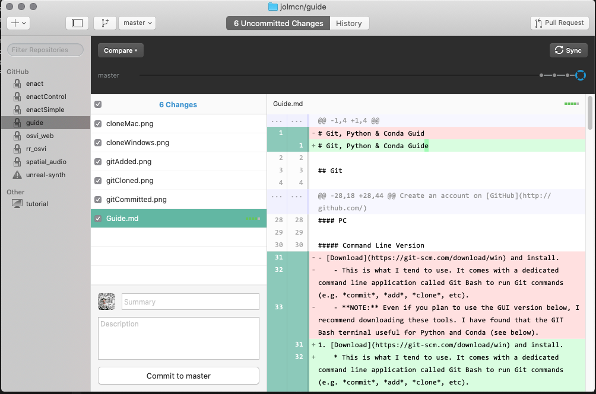
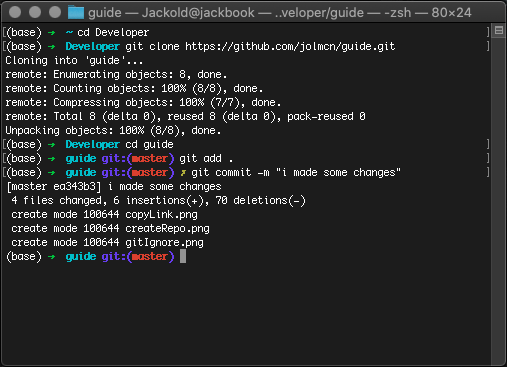

# Git, Python & Conda Guide

- **[Git](#git)**
  - [Overview](#overview)
  - [Installation](#installation)
    - [Prerequisites](#prerequisites)
    - [PC](#pc)
      - [Command Line Version](#command-line-version)
      - [GUI Version](#gui-version)
    - [Mac](#mac)
      - [Command Line Version](#command-line-version-1)
        - [Option A](#option-a)
        - [Option B](#option-b)
      - [GUI Version](#gui-version-1)
  - [Use](#use)
    - [Creating a Repo](#creating-a-repo)
    - [Cloning a Repo](#cloning-a-repo)
      - [GUI](#gui)
      - [Command Line](#command-line)
    - [Editing a Repo](#editing-a-repo)
      - [GUI](#gui-1)
      - [Command Line](#command-line-1)
- **[Python](#python)**
  - [Overview](#overview-1)
  - [Installation](#installation-1)
    - [PC](#pc-1)
    - [Mac](#mac-1)
- **[PIP](#pip)**
  - [Overview](#overview-2)
  - [Installation](#installation-2)
  - [Use](#use-1)
- **[CONDA](#conda)**
  - [Overview](#overview-3)
  - [Installation](#installation-3)
    - [PC](#pc-2)
    - [Mac](#mac-2)
  - [Use](#use-2)
- **[Realtime Voice Cloning](#realtime-voice-cloning)**


## Git

### Overview
Git is a version control system. It allows you to store code online and to move back and forward between older an newer versions of your code. 


Version control with Git goes something like this:
- A **Git Repository** is the name for a single project. **Repo** is the short name. 
- You can create a new **Git Repo** locally on your computer or using your Github/Gitlab account.
- You can download a **Repo** as a zipped folder directly, or you can *clone* it to your computer using either the terminal/command line or a GUI application. 
- Changes made to the downloaded (local) version of the **Repo** will not affect the version stored online until you *commit* and *push* your changes.
- Changes can be pushed to the **Master** branch of your **Repo** or to a new branch.
- You can switch easily between your **Master** branch and other created branches.
- Any changes you push can usually be reversed by *rolling back* to a previous *commit*.
- When working with a **repo** created by another Git user, you can create a  *fork* of the **repo**, essentially a copy of the **repo** on your own Git account that you can edit.
- When multiple people are working on a single **repo**, changes created on new branches can be **merged** into the *master* branch.
- This might not all be clear now, you will likely not need to use all of these functions! See **Use** section below for instructions on how to *clone* a **repository**, and how to *add*, *commit* and *push* changes.


### Installation

#### Prerequisites

Create an account on [GitHub](http://github.com/)

#### PC

##### Command Line Version
1. [Download](https://git-scm.com/download/win) and install.
	* This is what I tend to use. It comes with a dedicated command line application called Git Bash to run Git commands (e.g. *commit*, *add*, *clone*, etc).
	* **NOTE:** Even if you plan to use the GUI version below, I recommend downloading these tools. I have found that the GIT Bash terminal useful for Python and Conda (see below).
2. After installation, open the GIT Bash terminal, copy and paste the below code and hit enter (**replace 'username' and 'email' with the username and email you used when signing up to GitHub**)
	```
	git config --global user.name "username"
	git config --global user.email "email@example.com"
	```

##### GUI Version
1. [Download](https://desktop.github.com/) and install.
	* This is a desktop app created by GitHub. It will allow you to do all the same things you can do in the command line version but with a graphical interface that is useful for more easily seeing the changes made to your repo.
2. After downloading, sign in using your GitHub account.


#### Mac

##### Command Line Version

###### Option A
1. Git may already be installed on your Mac. If not, you can install it using the XCode Command Line Tools. To check if it is installed, open the **Terminal** application, copy and paste the following, and hit enter:
	```
	git --version
	```
2. If Git is already installed, you will see something like the image below:


3. If Git is not installed, you should be prompted to install it via **XCode**. Follow the installation instructions on screen.

4. Add your credentials by opening **Terminal**, copying and pasting the following, and hitting enter (**replace 'username' and 'email' with the username and email you used when signing up to GitHub**)
	```
	git config --global user.name "username"
	git config --global user.email "email@example.com"
	```

###### Option B

1. Install *[Homebrew](https://brew.sh/)* using the following steps:
	* Open the *Terminal* application on your Mac
	* Copy and paste the following into the terminal window, then press enter:
	``` 
	/bin/bash -c "$(curl -fsSL https://raw.githubusercontent.com/Homebrew/install/master/install.sh)"
 	```
2. Install Git using Homebrew
	* When Homebrew has finished installing, copy and paste the following into the terminal window, then press enter:
	```
	brew install git
	```

3. Add your credentials by opening **Terminal**, copying and pasting the following, and hitting enter (**replace 'username' and 'email' with the username and email you used when signing up to GitHub**)
	```
	git config --global user.name "username"
	git config --global user.email "email@example.com"
	```

##### GUI Version
1. [Download](https://desktop.github.com/) and install.
2. After downloading, sign in using your GitHub account.

### Use

#### Creating a Repo
1. Go to [Github](https://github.com)
2. In your GitHub homepage, click **New** as shown in the image below:


3. In the next page, set the name of your repo, and a description.


4. You can also add a **.gitignore** file and a README here. The **.gitignore** file tells Git which files to ignore when uploading changes. There are a  number of **.gitignore** files available for popular programming languages and libraries, or you can create your own custom **.gitignore**. See below, you can select an Unreal Engine **.gitignore** file - this will ignore, for example, files related to caching and backups in the `Intermediate` and `Saved` folders.


5. That's it! Repo created. If you want, you can upload files to the next page as shown in the image below (pretty self-explanatory), but in the next section I'll show you how to clone a repo to your computer and add files this way.


#### Cloning a Repo

##### GUI

1. Open GitHub Desktop
2. If you have already connected it to your account, you should see an option to *Clone a repository from the internet*. Click this and you should see a list of repositories already in you account (if you have any) and the **URL** tab which will allow you to clone repos from other Git users.


Select a repo, or enter a repo URL, set the 'Local Path' (i.e. where you want it to be downloaded to on your computer) and hit **clone**. The files will be downloaded and you're ready to go.

##### Command Line

1. Find the URL for the **repo** you want to clone by visiting the repo page and clicking the green **Code** button. Copy the https link. (For example, the link for this repo is `https://github.com/jolmcn/guide.git` )

2. Open **Terminal** (on Mac) or **Git Bash** (on Windows).

3. Navigate to the location where you want to download the repo using the `cd` command (cd = change directory). For example, if you want to download the repo to your `Documents` use the following to navigate to documents:
```
cd Documents
```

4. From `Documents`, or wherever else you'd like to store your **repo** (I keep mine in a folder called `Developer`) clone your repo using `git clone` followed by the URL of the **repo** then hit enter. e.g.:

```
git clone https://github.com/jolmcn/guide.git
```


5. That's it! Your repo is cloned. The files are downloaded and you're ready to go.


#### Editing a Repo

If you want changes made locally to your repo to be pushed to the online version, follow these steps:

##### GUI

1. Open Github Desktop and select your **repo**. Under the *Uncommitted Changes* tab you will see the changes you have made to the files in the repo since the last commit. Red lines indicate code that has been deleted, green indicates code that has been added/modified.



2. To **commit** your changes, add a summary and description of the changes you've made, then click *Commit to Master*


3. To **push** your changes to the online **repo**, click 'Sync' on the top right corner.

##### Command Line

1. Open **Terminal** (on Mac) or **Git Bash** (on Windows).

2. Navigate to your git repo using the `cd` command

3. Use the following command to *add* all files to your commit
```
git add .
```


4. Use the following command to *commit* the changes, with a message describing the changes
```
git commit -m "enter the message here"
```



5. Use the following command to *push* the commit to your GitHub account
```
git push
```


## Python

### Overview

Python is a popular, high-level coding language used widely in Machine Learning and AI applications, to name just a few contexts. Most ML projets will require you to run a Python program and/or download some other Python libraries. There are a number of different ways to download existing Python libraries.

### Installation

#### PC

1. Download and run the executable file from the [Python website](Windows x86-64 executable installer) to install Python on your computer. 
	* **NB: Make sure that you check the box for 'Add Python 3.7 to PATH' on the first window when you start to install - see image below
	* **Note**: The above link is for Python 3.7. The newest version is 3.8, but I have had trouble running Tensorflow and PyTorch projects using Python 3.8, so I recommend downloading 3.7

	

2. Open **Git Bash** and run the following command to check if Python has been successfully installed:
```
python --version
```

If it returns something like 'The command python is not recognised' then Python is ***not*** installed successfully.

#### Mac

The most recent version of Python 2 should already be installed on your Mac by default. Open **Terminal** and run the following command to ensure Python is installed:
```
python --version
```

If it returns something like 'the command python is not recognised', then Python is ***not*** installed.

To install Python:
1. Install Homebrew (if you have not already installed it as described above) by running the following command in **Terminal**:

```
/bin/bash -c "$(curl -fsSL https://raw.githubusercontent.com/Homebrew/install/master/install.sh)"
```

2. Install Python using Homebrew using the following command in **Terminal**;
```
brew install python@3.7
```

3. Run `python --version` again to confirm that Python has been installed (if it does not work, try restarting Terminal and running the command again).


## PIP

### Overview

**PIP** is the standard package management system for Python. In other words, it is the default tool for installing existing Python libraries. Unless you have created a local environment (e.g. using Miniconda - see below), libraries/packages installed with PIP will be installed globally on your computer.

### Installation


**PIP** should be installed automatically along with **Python**. Confirm that **PIP** is installed by running the following command in **Terminal** (on Mac) or **Git Bash** (on Windows):
```
pip --version
```

### Use

To install a Python Package using PIP run the following command in **Terminal** (on Mac) or **Git Bash** (on Windows):
```
pip install package-name
```

To install a *specific version* of a Python Package using PIP run the following command:
```
pip install package-name==1.0.0
```

To search for a specific Python Package using PIP run the following command:
```
pip search package-name
```

To list the Python Packages that have been installed in your current environment run the following command:
```
pip list
```

## CONDA

### Overview

Anaconda/Miniconda is a platform for creating enclosed environments for running Python projects. 

Conda allows us to run multiple projects on the same computer with different versions of Python or different versions of specific Python packages. Many existing repos on Github will require different versions of Python or specific Python packages, and Conda can allow us to run these projects more easily on the same device. When you enter a Conda environment, any packages installed via Conda or PIP will only exist in that environment. When that environment is deactivated, the installed packages will not be available.

### Installation

#### PC

1. Download and run the [Miniconda Installation File](https://repo.anaconda.com/miniconda/Miniconda3-latest-Windows-x86_64.exe)
2. Open the **Git Bash** application and run one of the following commands to test if Conda has installed correctly (you may need to restart your computer if it returns an error):
```
conda --version
```
```
conda --info
```

#### Mac

1. Download and run the [Miniconda Installation File](https://repo.anaconda.com/miniconda/Miniconda3-latest-MacOSX-x86_64.sh)
2. Open **Terminal** and run one of the following commands to test if Conda has installed correctly (you may need to restart your computer if it returns an error):
```
conda --version
```
```
conda --info
```

### Use

See the [Conda Cheat Sheet](https://kapeli.com/cheat_sheets/Conda.docset/Contents/Resources/Documents/index) for a full list of commands

All of these commands are to be run in **Terminal** (on Mac) or **Git Bash** (on PC).

- Create a new Conda environment (**Note: you can name your environment whatever you like**):
```
conda create -n environmentName
```

- List the Conda environments that you have created:
```
conda info -e
```


- Activate a Conda environment after creating it:
```
conda activate environmentName
```

- Deactivate the currently activated Conda environment:
```
conda deactivate
```

**The following commands should only be run when you are in an active Conda environment:**

- Install Conda packages using the following command:
```
conda install package-name
```

- Install a specific version of a Conda package:
```
conda install package-name==1.0
```

- Search for a specific Conda package:
```
conda search package-name
```

- List the Conda packages installed in the current active Conda environment:
```
conda list
```


## Realtime Voice Cloning

[Repo Link](https://github.com/CorentinJ/Real-Time-Voice-Cloning)

1. Open **Git Bash** and clone the repo to your computer's `Documents` folder using the following commands in this order:
```
cd Documents
```
```
git clone https://github.com/CorentinJ/Real-Time-Voice-Cloning
```
```
cd Real-Time-Voice-Cloning
```

2. If you do not aready have it installed, download **Cuda 10.1** from [here](https://developer.nvidia.com/cuda-10.1-download-archive-base?target_os=Windows&target_arch=x86_64&target_version=10&target_type=exelocal) using the settings shown in the image below:


3. Install Python **virtualenv** using pip with the following command in **Git Bash**:
```
pip install virtualenv
```

4. Create a virtualenv inside the repo folder using the following command in **Git Bash**:
```
virtualenv env
```

This creates an environment where any new packages installed will only be used when the environment is activated, similar to Conda above.

6. **Active the environment** using the following command in **Git Bash**
```
. env/Scripts/activate
```
If you've come this far successfully and the environment is successfully activated, any new lines in **Git Bash** will be preceded by the environment name `(env)`, and **Git Bash** should look something like the image below:


4. Install **PyTorch** by running following command in **Git Bash**:
```
pip install torch==1.6.0+cu101 torchvision==0.7.0+cu101 -f https://download.pytorch.org/whl/torch_stable.html
```

If the above command doesn't work, it may be because you have a different version of Cuda installed. In this case, visit [this page](https://pytorch.org/get-started/locally/) and enter the settings applicable to your machine.

5. Install the other packages required for the repo by running the following command in **Git Bash**
```
pip install requirements.txt
```

This should install all of the packages in the requirements.txt file. I had trouble with this, so i had to install them individually! If you also have trouble, try running the below command instead:
```
pip install tensorflow==1.15 umap-learn visdom librosa matplotlib numpy scipy tqdm sounddevice SoundFile Unidecode inflect PyQt5 multiprocess numba==0.48
```

6. Download the [pretrained models](https://github.com/CorentinJ/Real-Time-Voice-Cloning/wiki/Pretrained-models). The unzipped folder will contain three subfolders - `encoder`, `synthesizer`, and `vocoder`. Copy the contents of these folders into the folders with the same names in the repo.

7. ***Optional*** Download the LibriSpeech dataset from [here](http://www.openslr.org/resources/12/train-clean-100.tar.gz). Create a new folder inside the `Real-Time-Voice_cloning` repo folder, then extract the contents of the downloaded dataset to `Real-Time-Voice-Cloning/Datasets/LibriSpeech/train-clean-100`
**NOTE**: If you do not download this dataset you can use your own audio files or record directly into the GUI to generate audio.

8. ***Finally*** **launch the Toolbox**.
If you have downloaded the dataset run the following command:
```
python demo_toolbox.py -d Datasets
```

If you have **not** downloaded the dataset, run the following command:
```
python demo_toolbox.py
```

You should see the following window open: 


- Click on **Browse** to upload an audio file from your computer of someone speaking, to replicate this voice. If you have downloaded the dataset, you can click **Load** to load an audio file from the dataset.
- Enter the text you would like to have synthesized in the textbox and click **Synthesize and vocode**. 
- When synthesis and vocoding is complete, you will hear the generated audio play. 
- To save the audio, click **Export**